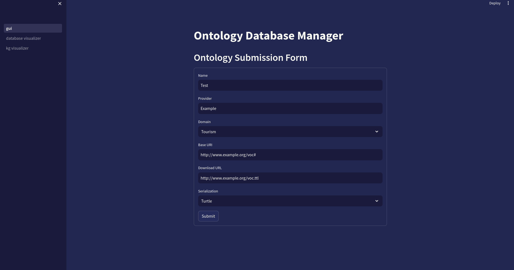
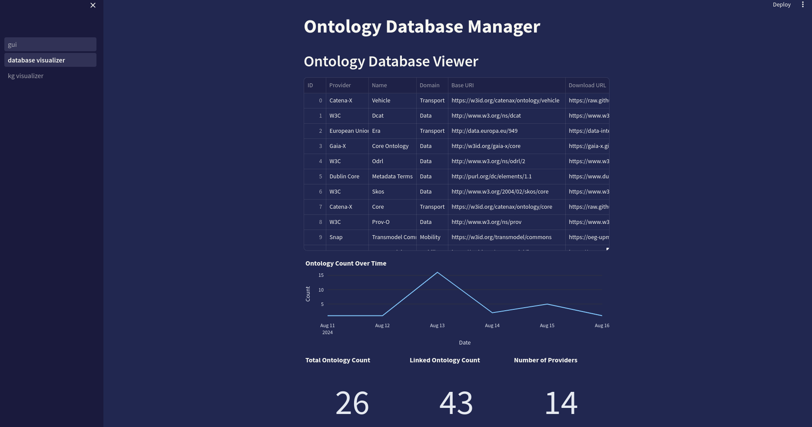
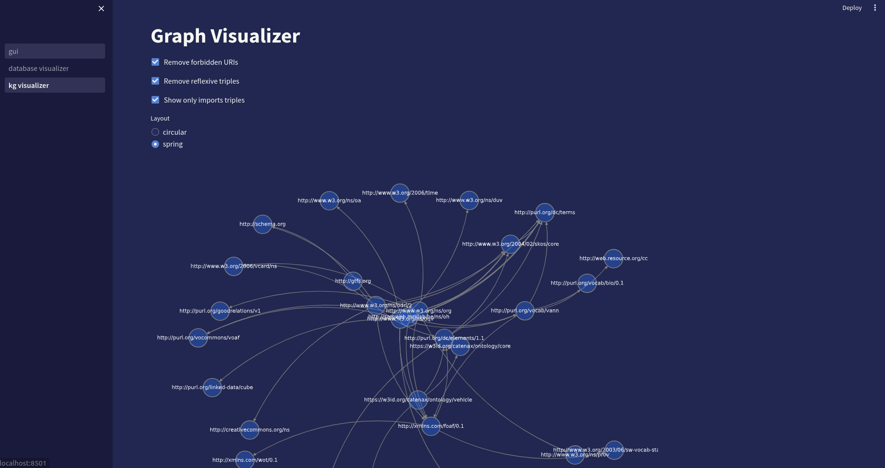

# Ontology Tracking Visual Tool

## Presentation
This tool provides a visual knowledge graph representation of the ontologies identified as relevant for Eona-X by its members and their interrelations. Its ontology database can be updated by anyone through a graphical user interface reachable on the web, resulting in a modification of the visual representation.

## Components
It is composed of three components:

### Ontology Database Manager
 + ontology data modeling
 + DBMS (pandas)
 + GUI (Streamlit)

### Graph constructor
 + RDF/OWL parser
 + RDF knowledge graph constructor

### Graph visualizer
 + either vOWL or Neo4J's visual renderer

## Ontology Database Manager

### Functional Schema

### Data Modeling
Concerning the relational database, it consists in one table **Ontology** with these following properties:
 + id
 + name
 + domain
 + subdomain
 + syntax
 + base_uri
 + download_url

### GUI

#### Ontology Submission Form

#### Ontology Database Manager

## Graph visualizer

